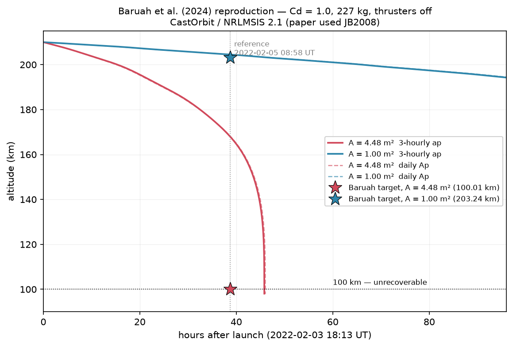
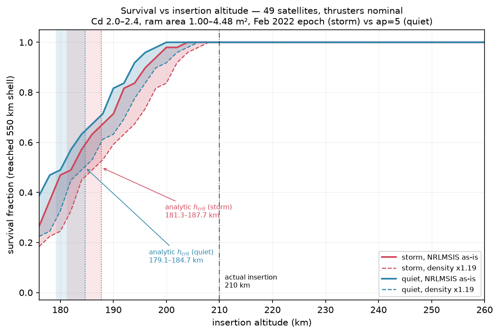
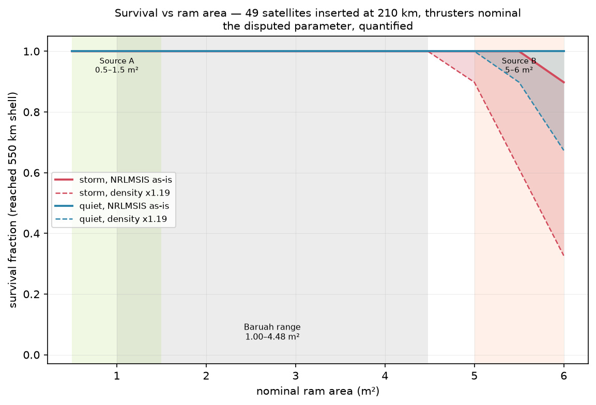
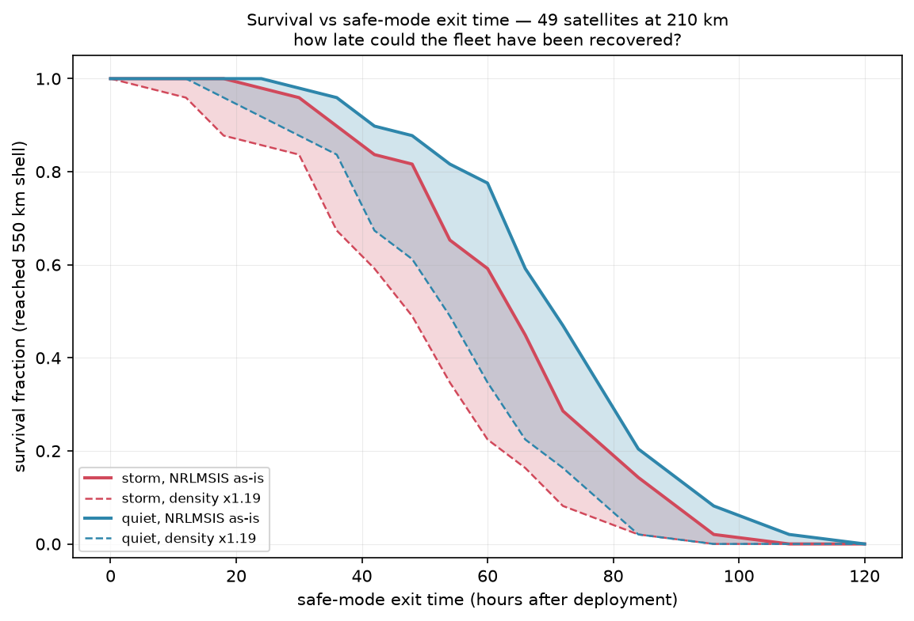
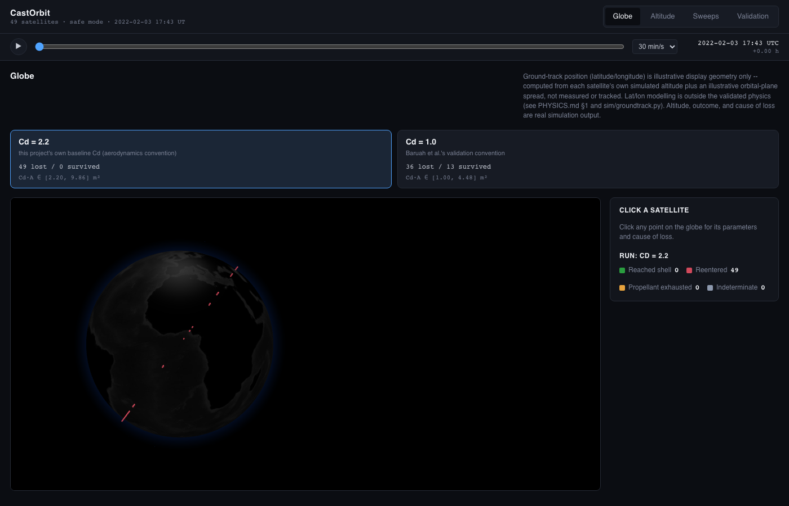
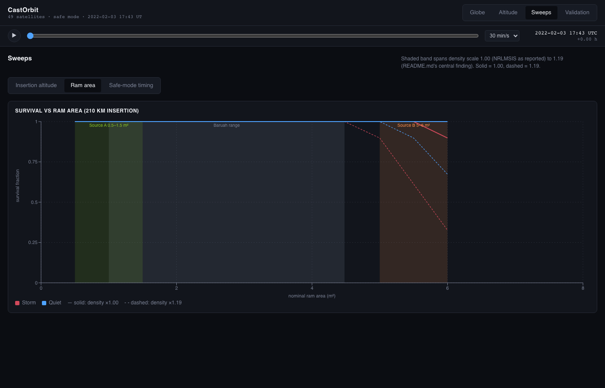
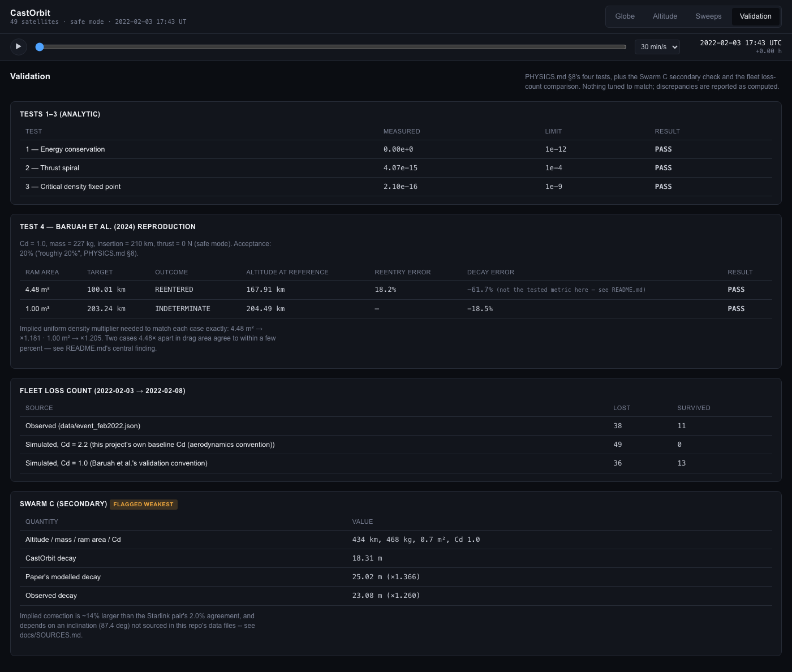

# CastOrbit

A satellite design tool built on an orbital-decay engine that was validated
against the published February 2022 Starlink loss before being pointed at
anything else.

**The one-line result:** the model's drag term runs 15–20% low against reality
at 210 km, confirmed four independent ways — and once that single correction
is applied, the model's picture of the February 2022 loss is consistent with
what happened.

Describe a satellite and a mission; the engine sizes it, flies it, and says
whether it complies with post-mission disposal rules. **The February 2022
reproduction is not legacy code — it is the reason to believe any of the rest**,
and it is a regression test that has to keep passing
([`docs/V2_BRIEF.md`](docs/V2_BRIEF.md) §1).

This is not a satellite tracker or a 3D visualisation of public TLE data. Every
number below was computed from the equations in [PHYSICS.md](PHYSICS.md) and
checked against a peer-reviewed result: Baruah, Y., Roy, S., Sinha, S.,
Palmerio, E., Pal, S., Oliveira, D. M., & Nandy, D. (2024). *The Loss of
Starlink Satellites in February 2022: How Moderate Geomagnetic Storms Can
Adversely Affect Assets in Low-Earth Orbit.* Space Weather, 22, e2023SW003716
([DOI: 10.1029/2023SW003716](https://doi.org/10.1029/2023SW003716)). Every
other external source this project cites — the atmosphere model, the space
weather indices, the satellite hardware figures — is indexed in
[`docs/SOURCES.md`](docs/SOURCES.md).

**Where the model refuses to answer, it says so.** Two of three held-out mass
predictions are declined rather than guessed, and a compliance verdict resting
on an unresolved mass does not render at all. That is
[a failed gate, recorded](#mass-estimation-that-refuses-to-guess), not a
feature list.

---

## The central finding

The equation this simulator integrates ([PHYSICS.md §3.2](PHYSICS.md#3-core-equation))
is

```
da/dt = 2*(F/m)*a**1.5/sqrt(MU) - rho*(Cd*A/m)*sqrt(MU*a)
```

Look at the drag term: `rho`, `Cd` and `A` never appear separately, only as the
product `rho * Cd * A`. Nothing in a decay curve alone can tell you whether
that product is low because the density model is low, because the drag
coefficient is off, or because the ram area is smaller than assumed — only the
product is observable from an altitude history. That degeneracy turns out to
be the whole story here.

**Four independent diagnostics find the same ~15–20% deficit in that
product**, each holding a different piece fixed. The first three are decay
curves; the fourth never touches one.

**1 — Baruah's 4.48 m² bounding case.** Reproducing the paper's own convention
(Cd = 1.0, mass 227 kg, thrusters off) at the maximum ram area, the model
reenters at 45.81 h after launch against the published 38.75 h — 18.2% late.
Bisecting on a uniform multiplier applied to NRLMSIS density (holding Cd and A
at the paper's values) finds the model needs **×1.181** to hit the paper's
reentry time exactly.

**2 — Baruah's 1.00 m² bounding case.** Same convention, minimum ram area: the
model reaches 204.49 km at the reference time against the paper's 203.24 km,
decaying 5.51 km against a published 6.76 km — 18.5% too little. The same
bisection, run independently on this completely different trajectory shape
(this satellite never gets close to reentering), needs **×1.204**.

Two configurations 4.48× apart in drag area, one reentering and one barely
decaying, agree on the correction to within **2.0%**. That is the signature of
a single systematic offset in `rho·Cd·A`, not a bug specific to one
configuration — see `density_scale_diagnostic` in
[`sim/validate.py`](sim/validate.py).

**3 — The fleet loss count, from a completely different angle.** The first two
diagnostics adjust density while holding Cd and A at Baruah's own values. The
fleet reproduction does the opposite: it holds density fixed (scale 1.0) and
asks what ram-area range, combined with this project's own baseline drag
coefficient (Cd = 2.2, not Baruah's 1.0), reproduces the observed 38 losses out
of 49 satellites kept in safe mode (F = 0) from deployment to 2022-02-08.

Naively combining Cd = 2.2 with Baruah's published area range (1.00–4.48 m²)
loses **all 49** satellites — unsurprising, since that range was calibrated
against Cd = 1.0, and 2.2× the drag coefficient with the same area is roughly
2.2× the drag. Solving for the area range that *does* reproduce 38 losses at
Cd = 2.2 gives a uniform range of **0.52–2.34 m²**, i.e. the published range
scaled by **×0.523**.

That scaled range, converted back to the effective drag parameter that
actually enters the equation:

```
Cd * A  =  2.2 * [0.52, 2.34]  =  [1.15, 5.15] m²
```

Compare that to Baruah's own effective drag range, `Cd * A = 1.0 * [1.00,
4.48] = [1.00, 4.48] m²`. The two ranges nearly coincide — and the small gap
between them (roughly 15% at both ends) is the same ~15–20% correction found
by diagnostics 1 and 2, arrived at from the fleet's *loss count* rather than
any single satellite's decay curve, using a different Cd convention entirely.

**4 — The geometry, which never touches a decay curve at all.** The first three
diagnostics all read the answer out of how fast something fell. That is a
genuine weakness: they share an atmosphere model, an integrator, and the
assumption that the observed decay is telling you about drag rather than about
something else. A fourth line of evidence that never integrates anything is
worth more than a fourth that does.

The projected-area solver ([`sim/geometry.py`](sim/geometry.py), Phase 8) takes
the chassis dimensions and deployed span from
[`satellite_specs.json`](data/satellite_specs.json) and computes the area
presented to the flow, for any attitude. In the knife-edge attitude the
February 2022 fleet was actually commanded into, it gives **0.27–0.61 m²**
across the swept dimension range, nominally 0.405 m². Combined with this
project's standard free-molecular `Cd = 2.2`:

| Route | `Cd` | `A` | `Cd·A` |
|---|---|---|---|
| Baruah et al. | 1.0 (stated simplification) | 1.00 m² | **1.00 m²** |
| Geometry + free-molecular convention | 2.2 | 0.405 m² | **0.89 m²** |

Two different splits of a product that is not separately observable, landing
**11% apart** — reached from a ruler and a drag convention rather than from an
altitude history. The geometry-derived range also reproduces the *secondary
source* knife-edge figures recorded in the spec file (0.3–0.7 m²) rather than
Baruah's 1.00 m², which is a stated lower bound on a swept range, not a
measurement.

Four methods, four different kinds of evidence, one number. This is what
V2 was for: pinning `A` from geometry constrains one of the three inseparable
factors by construction instead of by assumption
([`docs/V2_BRIEF.md`](docs/V2_BRIEF.md) §2).

### What the published 4.48 m² actually is

The solver also reinterprets the number the whole V1 sweep was built around.

Baruah's published *maximum* ram area, 4.48 m², reproduces almost exactly as
the **face-on area of the chassis** using the larger of the two sourced
dimension pairs: 3.0 × 1.5 = 4.50 m², agreeing to **0.45%**. It is not a
broadside. A genuine broadside — array included, flat to the flow — is
**~15 m²**, more than three times larger. It is not even the chassis's own
geometric maximum: a box presents most area corner-on, giving 4.65 m² for the
same chassis, 3.3% above face-on.

So 4.48 m² is best read as *chassis face-on, solar array feathered*. That is
not a quibble about a number. It says the published range the V1 sweeps used —
1.00 to 4.48 m² — describes a **feathered configuration throughout**, which is
consistent with the knife-edge attitude the fleet was commanded into
([PHYSICS.md §5](PHYSICS.md#5-safe-mode--the-physical-crux)) and with the spec
file's own note that one secondary source describing a 5–6 m² area also
describes the array as "feathered parallel to the velocity vector", a
contradiction that source never resolves. Pinned in
[`tests/test_geometry.py`](tests/test_geometry.py).

**What this means:** presenting "Cd = 2.2 loses everyone, Cd = 1.0 roughly
matches" as a contradiction between two arbitrary choices would be the wrong
reading. It is the same 15–20% effective-drag correction showing up a third
time, because `Cd` and `A` were never separable from each other or from `rho`
in the first place. The project's own runs use Cd = 2.2
([`satellite_specs.json`](data/satellite_specs.json), standard free-molecular-flow
convention); Baruah's use Cd = 1.0, stated as a simplification. Both are
consistent with the same physical satellite once the ~18% deficit is accounted
for.



*Both Baruah bounding cases, Cd = 1.0, 227 kg, thrusters off from the
2022-02-03 18:13 UT epoch. Stars mark the published targets at the 2022-02-05
08:58 UT reference time. Solid vs dashed lines compare the real 3-hourly space
weather history against a daily-average simplification — the two are visually
indistinguishable, discussed in [Uncertainty exceeds signal](#uncertainty-exceeds-signal).*

**What NRLMSIS's own known bias predicts.** This isn't a free parameter fit —
NRLMSIS 2.1 carries a documented 15–30% density error during geomagnetic
storms ([PHYSICS.md §10.4](PHYSICS.md#10-known-limitations)). A measured
15–20% deficit sits at the low edge of that band, not outside it. The
[Swarm C secondary validation](#validation) below, at a different altitude
entirely, points the same direction but by a larger margin — evidence the
offset is real but not a single altitude-independent constant.

---

## Validation

Four tests are specified in [PHYSICS.md §8](PHYSICS.md#8-validation); a fifth,
Swarm C, is an optional secondary check the paper itself uses.

| Test | What it checks | Result |
|---|---|---|
| **1 — Energy conservation** | `rho=0, F=0` ⇒ `da/dt=0` exactly, over a simulated week | Relative change in `a`: **0.000e+00** (limit 1e-12) |
| **2 — Pure thrust spiral** | Closed-form `a(t) = a0/(1-(F/m)t√(a0/MU))²` vs numerical, 1 day | **4.07e-15** relative (limit 1e-4). Convergence order independently confirmed at coarser steps: **4.00–4.03** (see `test_2b`/`test_2c` in [`tests/test_validation.py`](tests/test_validation.py) — at 10 s the error is round-off floor, not truncation) |
| **3 — Critical density fixed point** | `da/dt=0` at the computed `h_crit`, held 1 hour | `\|da/dt\|` / thrust term: **2.1e-16** (limit 1e-9) |
| **4 — Baruah reproduction** | Two bounding cases vs published targets | **+18.2%** and **−18.5%** decay-timing error — both inside the paper's own 20% acceptance band, and both explained by the single finding above |
| **Swarm C (secondary, flagged weakest)** | 434 km, 468 kg, 0.7 m², Cd 1.0, 53.78 h window | CastOrbit: 18.31 m decay. Paper's model: 25.02 m (**×1.366** implied). Observed: 23.08 m (**×1.260** implied) |

**Why Swarm C is flagged as the weakest evidence, not dropped.** Its implied
correction (×1.366) is ~14% larger than the Starlink pair's tight 2.0%
agreement, and it depends on an inclination (87.4°) that is **not in this
repo's data files** — I used the published Swarm C orbital inclination by the
same density-sampling convention applied elsewhere, but the sensitivity is
real: sampling latitude alone moves the implied correction from ×1.218 (0°) to
×1.449 (45°), a wider spread than the gap being explained. Swarm C confirms the
*direction* of the offset at a second altitude; it should not be read as
independently pinning its *size*. See `swarm_c_validation` in
[`sim/validate.py`](sim/validate.py).

Four validation tests, all passing, live in
[`tests/test_validation.py`](tests/test_validation.py),
[`tests/test_baruah.py`](tests/test_baruah.py),
[`tests/test_atmosphere.py`](tests/test_atmosphere.py) and
[`tests/test_critical.py`](tests/test_critical.py). **192 tests total**, run
with `pytest` — the four validation tests above are the ones that matter, and
the V2 work (adaptive stepping, geometry, disposal, mass bounds) is held to
reproducing them unchanged.

---

## Uncertainty exceeds signal

The three required parameter sweeps ([PHYSICS.md §9](PHYSICS.md#9-monte-carlo))
each ran at density scale 1.0 (NRLMSIS as reported) and 1.19 (the correction
found above), plotted as a band, so the uncorrected result stays visible rather
than being silently folded in.



*49 satellites, thrusters nominal from deployment, Cd 2.0–2.4, ram area
1.00–4.48 m². Solid = NRLMSIS as-is, dashed = density ×1.19 band. Shaded
vertical bands are the analytic critical altitude from
[§4](PHYSICS.md#4-critical-altitude), computed independently — see
[next section](#two-independent-code-paths-agree).*

The headline number from this sweep: **the storm shifts the 50% survival
altitude by +2.0 km (182.2 → 180.2 km, storm vs quiet); the density-model
uncertainty shifts it by +4.2 km (182.2 → 186.5 km, scale 1.0 vs 1.19)**. The
uncertainty in the atmosphere model moves the answer **more than twice as far**
as the geomagnetic storm the whole project is nominally about. That is
[PHYSICS.md §10.4](PHYSICS.md#10-known-limitations) as a number rather than a
caveat, and it is the reason this section comes before the sweep results
themselves rather than after.

Two smaller findings from the same sweeps:

- **The disputed ram-area range barely matters.** Survival is flat at 1.00
  across the *entire* published 1.00–4.48 m² range at 210 km — the 4–10×
  disagreement between secondary sources on the *nominal* ram area
  ([`data/satellite_specs.json`](data/satellite_specs.json)) turns out to be
  irrelevant to this outcome. It only starts to bite at the far larger,
  independently disputed 5–6 m² figure, and only with the density band applied.

  
- **3-hourly vs daily-average space weather barely matters either.** Despite
  the Feb 2022 storm's two distinct ap peaks (09–12 UT on 3 Feb, before launch;
  15–18 UT on 4 Feb), using the real 3-hourly history instead of the daily
  average shifts Baruah reentry timing by **−0.5%** (visually indistinguishable
  in the figure above). `AP_AVG` is by construction the mean of the eight
  3-hourly values, and a multi-day decay integral averages the spikes back out.



*How late could the fleet have recovered? 50% survival at 63.9 h of safe-mode
dwell (storm, scale 1.0); 47.4 h with the density correction applied.*

---

## Two independent code paths agree

The Monte Carlo ensemble in [`sim/montecarlo.py`](sim/montecarlo.py) and the
analytic critical-altitude solver in [`sim/critical.py`](sim/critical.py) never
call each other — the sweep integrates 49 trajectories numerically; the solver
bisects `rho(h) = rho_crit(h)` from [PHYSICS.md §4](PHYSICS.md#4-critical-altitude)
using nothing but the atmosphere model. They agree anyway: the 50% survival
crossing in the Monte Carlo sweep sits at **182.2 km**, and the independently
computed critical-altitude band (mid-range Cd = 2.2, A = 2.74 m²) is
**181.3–187.7 km** — the numerical result falls inside the analytic band, near
its lower edge, which is where it should sit: the ensemble also varies Cd, A,
mass and thrust around the sweep's mid-range point, so the *fraction* crossing
50% survival at any given altitude is pulled slightly below the single-point
estimate. Two different pieces of code, built for different purposes, landing
on the same altitude, is the closest thing this project has to a free
correctness check.

The vectorised ensemble propagator is also pinned against the scalar
propagation path used for the Baruah validation
(`test_ensemble_matches_scalar_propagation` in
[`tests/test_montecarlo.py`](tests/test_montecarlo.py)): both go through the
same `rk4_step` and `derivatives`, and after two days of independent
propagation they agree to **exactly 0.0 relative difference**. There is one
integrator in this codebase, not two that could quietly drift apart.

---

## Mass estimation that refuses to guess

A design tool has to turn a mission into a mass, because mass sets the
ballistic coefficient and therefore every decay number downstream. V2 does
this by interpolating between real spacecraft — 20 sourced entries from a
5.2 kg CubeSat to a 3650 kg GEO comsat
([`reference_satellites.json`](data/reference_satellites.json)). Nothing is
fitted; no coefficient appears in [`sim/mass_model.py`](sim/mass_model.py), and
an LLM never produces a kilogram figure.

**Gate 9 failed. 1 of 3.** Three spacecraft were held out — one per size class,
each with published *dry* mass and published power, chosen before any
prediction was computed:

| Spacecraft | Actual | Predicted | Error |
|---|---|---|---|
| PROBA-V | 140 kg | 192 kg | **+37.0%** |
| Sentinel-2 | 1016 kg | 1018 kg | +0.2% |
| GOES-16 | 2857 kg | 1863 kg | **−34.8%** |

### The PROBA-V finding: a method limit, not a data gap

The obvious reading of a 37% miss is that the table is too thin, and the
obvious fix is more rows. That reading is wrong here, and the distinction is
the most useful thing this phase produced.

**PROBA-V (320 W, 140 kg) and Deimos-2 (330 W, 310 kg) are real spacecraft at
essentially identical power whose masses differ by 2.2×.** Across the
earth-observation class, kg/W spans 3.6×. No predictor taking power alone can
separate those two spacecraft — not with a denser table, not with a better
interpolation scheme, not at all. The 25% bar is unreachable at the small end
by construction. Adding rows cannot fix a predictor that lacks the information.

GOES-16 misses for a different and more ordinary reason: at 0.714 kg/W it is
simply heavier per watt than both its neighbours (0.500 and 0.452) — a
six-instrument payload on a 15-year GEO bus. A population outlier, not an
arithmetic error.

### So the method was bounded, not extended

Rather than build the component-level mass estimating relationships that
[`V2_BRIEF.md`](docs/V2_BRIEF.md) §5 defers to stage 2, the existing method now
declines to answer where it cannot. A point estimate is withheld when the
bracketing spacecraft are more than 4× apart in power, or when kg/W among
comparable spacecraft varies by more than 2×. Re-scored, **table unchanged**:

| Spacecraft | Actual | Result | Range | Contains actual |
|---|---|---|---|---|
| PROBA-V | 140 kg | refused | 83–301 kg | ✅ |
| Sentinel-2 | 1016 kg | 1018 kg (+0.2%) | 769–1424 kg | ✅ |
| GOES-16 | 2857 kg | refused | 1040–3758 kg | ✅ |

All three ranges contain the truth, and the two that missed the bar are exactly
the two now refused. **The gate is still recorded as failed** — one of three —
in [`docs/ARCHITECTURE.md` §5](docs/ARCHITECTURE.md). A gate that failed and was
recorded is worth more than one quietly relaxed until it passed.

One design detail was nearly a trap and is worth stating. The natural way to
build the interval is from *local* kg/W scatter near the requested power.
Measured before being wired up, PROBA-V's local window holds three spacecraft
whose kg/W agree to within 1.17× — which would have produced a **tight**
interval excluding the true mass by a factor of two. A confident-looking wrong
interval is worse than a wrong point estimate, because it also claims to know
its own error. Local scatter is therefore only used with at least four samples;
otherwise the class-wide spread applies.

### The refusal propagates

```
mass interval  ->  ballistic coefficient  ->  decay time  ->  compliance
   [lo, hi]         Bc = m/(Cd*A)            propagated       verdict at
                    monotone increasing      at both ends     both ends
```

Every step is monotone in mass — heavier means a higher ballistic coefficient,
slower decay, and harder compliance — so the two endpoints bound every interior
value exactly. **A compliance verdict resting on an unresolved mass does not
render**: it returns `NOT_ASSESSABLE` with `renderable = False`, and the mass
model's reasons pass through verbatim. A verdict that flips between the
endpoints returns `AMBIGUOUS`, also non-renderable — at 420 km a 1700 W design
complies naturally at the light end of its own mass uncertainty and needs a
disposal burn at the heavy end, so the mass interval decides the answer rather
than the design.

### What comes next, and which term will dominate

`Cd·A` and mass are currently bounded **separately**. The compliance
propagation above treats ram area as exact, and the geometry solver's own
0.27–0.61 m² knife-edge range is not composed with the mass interval. Doing so
is the next step, and it is not just bookkeeping: the two are not independent,
because the same geometry that sets `A` also constrains the bus volume that
correlates with mass.

**Mass is expected to dominate, by roughly a factor of two.** The mass interval
runs 3.6× wide at the small end where the method refuses; the geometry range is
about 2.3× wide (0.27 to 0.61 m²) and is bounded by *sourced dimensions* rather
than by population scatter, so it tightens as sourcing improves. The mass
spread does not — it is irreducible under a power-only predictor, as PROBA-V
shows. Composing them without saying which dominates would obscure exactly the
thing a designer needs to know: better spacecraft dimensions will not help,
and a second mass predictor will.

---

## Limitations

Stating these first is the difference between a result that survives being
questioned and one that doesn't ([`docs/ARCHITECTURE.md` §1](docs/ARCHITECTURE.md)).

1. **`PROPELLANT_EXHAUSTED` is deliberately not modelled.** No propellant mass
   is published for the v1.5 bus in
   [`data/satellite_specs.json`](data/satellite_specs.json), and inventing one
   would put a fabricated number into a headline result. Mass depletes
   correctly via `dm/dt` using the *derived* Isp (1666 s, itself scaled from a
   published relative claim, not directly published — see the specs file), but
   there is no dry-mass floor, so this outcome is unreachable by construction
   and every batch reports it as zero. That is a stated limitation, not an
   observation about the fleet.
2. **Circular orbit assumption.** Real insertion was elliptical with a ~210 km
   perigee. A circular model at perigee altitude overestimates time-averaged
   drag; a model at mean altitude underestimates it. Direction of the bias is
   not quantified here.
3. **Single-point density sampling.** Density is evaluated at one
   latitude/longitude rather than integrated around the orbit. The paper cites
   non-uniform storm-time density enhancement as a possible reason 11
   satellites specifically survived — this model cannot distinguish which 11.
4. **Tangential thrust only.** Real orbit-raising uses non-tangential steering
   laws.
5. **Empirical atmosphere model error.** NRLMSIS carries a documented 15–30%
   density error during storms — this is the dominant uncertainty in the
   entire model, larger than any other parameter spread swept in §9, and is
   the subject of the central finding above.
6. **Ram area is inferred, not published.** The 1.00–4.48 m² range comes from
   Baruah et al.'s own geometric assumptions, not from SpaceX. V2's geometry
   solver derives area from chassis dimensions instead, but those dimensions
   are themselves `disputed` and `estimated` in the spec file — the solar array
   chord in particular is assumed equal to the chassis width and is not
   independently sourced.
7. **No attitude dynamics.** Attitude is a choice of ram area `A`, not a
   simulated state. Real satellites tumbled.
8. **Swarm C's orbital inclination is not in this repo's data** and was
   supplied externally (87.4°, published) rather than sourced alongside the
   other validation inputs. See the Swarm C caveat above.
9. **Disposal Δv is priced on circular orbits.** Because the state excludes
   eccentricity, the compliance verdict uses a two-burn transfer to a lower
   circular orbit — the only disposal orbit this engine can propagate. Real
   operators drop perigee with a single cheaper burn. The verdict is therefore
   a conservative bound, not an estimate, and adding eccentricity is the
   highest-value remaining physics extension
   ([`docs/PHYSICS_V2.md`](docs/PHYSICS_V2.md) §V2.4).
10. **Multi-year runs hold solar activity constant.** Future space weather is
   not predictable past the end of `SW-All.csv`, so long-horizon runs sweep
   low/mean/high activity levels and report a band. Read those as **bounds,
   not scenarios** — no real 25-year period sits at one level, since the solar
   cycle is ~11 years.
11. **Mass estimation is stage 1 only, and fails its gate.** See
   [Mass estimation that refuses to guess](#mass-estimation-that-refuses-to-guess).

Full list with sourcing: [PHYSICS.md §10](PHYSICS.md#10-known-limitations).

---

## How to run

```bash
uv venv --python python3.12 .venv
uv pip install --python .venv/bin/python pymsis==0.12.0 numpy scipy pytest matplotlib
.venv/bin/python -m pytest -q                 # 192 tests

.venv/bin/python -m sim.validate              # Baruah + Swarm C reproduction
.venv/bin/python -m sim.sweeps                # the three §9 sweeps + validation payload
.venv/bin/python -m sim.export                # out/batch.json, the fleet reproduction
```

These write figures and JSON to `out/` (gitignored except for the PNGs
embedded above, which are committed so they render on GitHub without a build
step).

`pymsis` is pinned to 0.12.0 — the version the [PHYSICS.md §4.1](PHYSICS.md#41-verified-sanity-values)
reference table was generated against. System Python on the reference machine
was 3.9, too old for current `pymsis` wheels; the venv above targets 3.12.

### Frontend

```bash
cd web
npm install
npm run dev       # http://localhost:5173, reads out/batch.json and out/sweeps.json
```

Four views (globe, altitude, sweeps, validation) over the two JSON files
above; no physics runs in the browser. See [`web/README.md`](web/README.md).

#### Interface

  

*Globe, sweeps, and validation views. Every number on screen comes from
`out/batch.json` or `out/sweeps.json` — see the hard rules in
[`web/README.md`](web/README.md).*

Project structure, build order, and the JSON export contract:
[`docs/ARCHITECTURE.md`](docs/ARCHITECTURE.md). Full equation set and the four
validation test specifications: [`PHYSICS.md`](PHYSICS.md). Every external
source cited: [`docs/SOURCES.md`](docs/SOURCES.md).
